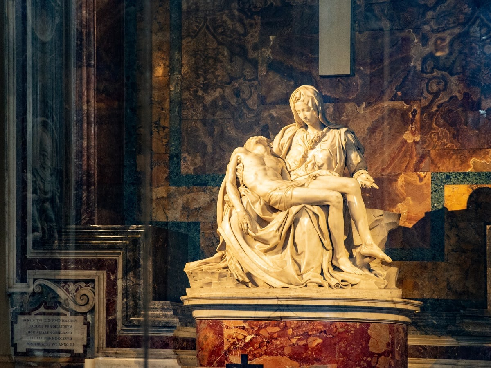
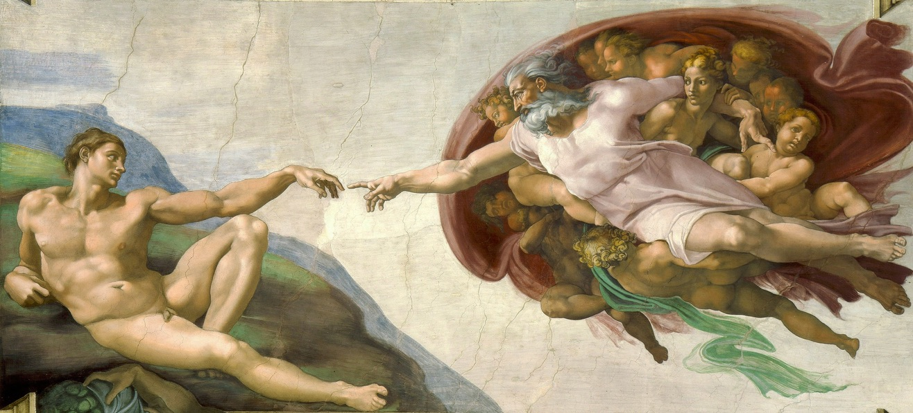
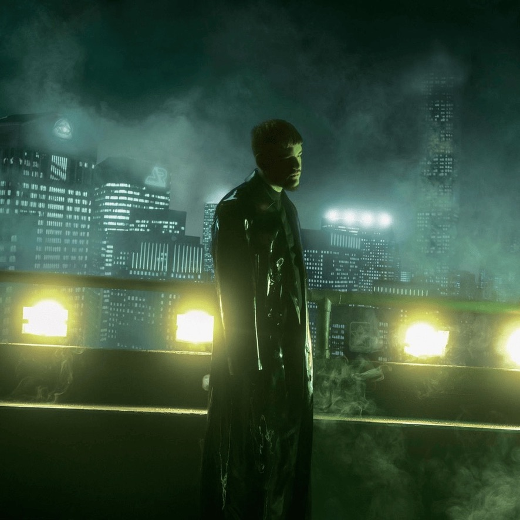
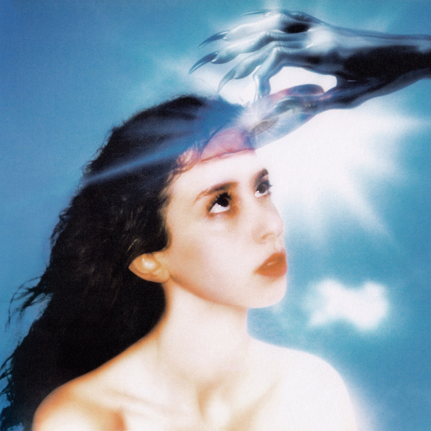
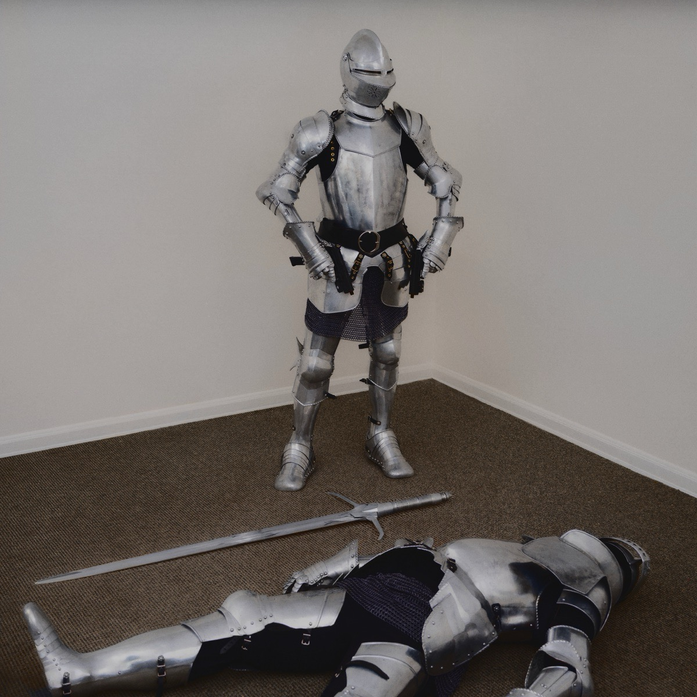
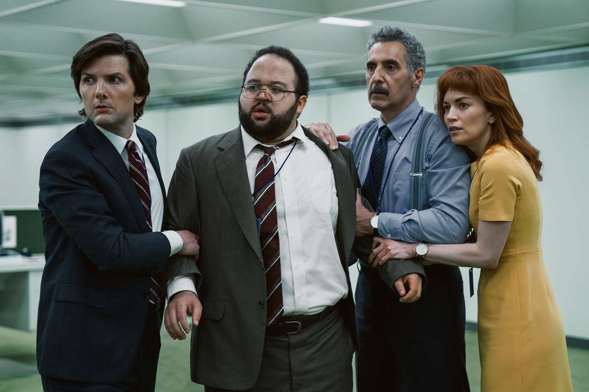

At any moment in time, my identity is influenced by art in a foundational way. My thoughts, perspective,
and behaviors are cultivated by the art I consume. I don't think that I am unique in this fact, either.
Each of us are influenced by art in one way or another. Creation and consumption are fundamental
to us as Humans. So in an attempt to better understand and guide the things I create, I'd like to
make a habit of reflecting on the notable pieces I consume.

### Art

Let's start this off with a bang. In the past, I believe I have been quick to discredit an artist that had
one or only a handful of exceptional pieces. An artist in desperate pursuit of something new that would
rival their masterpiece, repeatedly falling short. The reality is that most artists orchestrate only one
masterpiece within a lifetime, if any at all. Every person is limited to a finite number of great achievements
or moments. To create something special in any capacity is an extraordinary feat. However, there are some artists
that exceed the expectation of only a handful of exceptional pieces. I find myself deeply influenced by the artist
who shattered the expectation of creative limitation entirely.

**Pietà - Michelangelo**

**Creation of Adam (Sistine Chapel) - Michelangelo**

---

### Music

**2093 (2024) - Yeat**

**Imaginal Disk (2024) - Magdalena Bay**

**They Left Me with a Gun (2025) - Paris Texas**

---

### Television

**Severance, Season 1 (2022)**

---

### Film

---

### Literature

---

### Architecture
